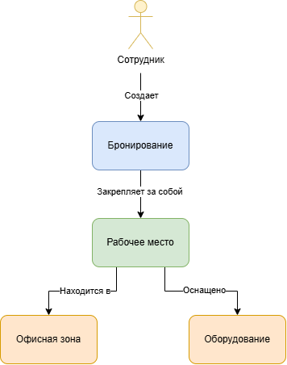

# Лабораторная работа №1
## Анализ предметной области информационной системы
# Выполнила: Монина Анастасия, ИТД-31

## 1. Описание предметной области
Предметной областью является процесс управления физическим офисным пространством в условиях гибридного формата работы сотрудников. В таком формате столов в офисе физически меньше, чем числится сотрудников, поэтому традиционное закрепление рабочих мест за конкретными людьми становится неэффективным. Требуется автоматизированный учет ресурсов (столов, переговорных и их оснащения), процесс резервирования пространства на определенные даты и временные слоты, а также контроль текущей занятости мест.

## 2. Проблема и цель системы
**Проблема:** Учет рабочих мест ведется вручную или отсутствует вовсе, из-за чего сотрудники тратят рабочее время на поиск свободного стола с нужным оборудованием, возникают конфликтные ситуации при двойном занятии одного места, а руководство не имеет объективных данных о реальной загруженности офиса для оптимизации затрат на аренду.

**Цель:** Разработать информационную систему для централизованного учета, бронирования и мониторинга рабочих мест, которая обеспечит сотрудникам гарантированный доступ к нужному оборудованию, исключит накладки и предоставит аналитику использования офисного пространства.

**Область применения:** Система предназначена для использования во внутрикорпоративной среде компаний, практикующих гибридный формат работы.

## 3. Анализ предметной области
В процессе анализа были выделены следующие ключевые объекты предметной области и их характеристики:
1. **Сотрудник** 
   * *Назначение:* Пользователь системы, инициатор бронирования.
   * *Характеристики:* ID сотрудника, ФИО, должность, отдел, email, роль.
2. **Рабочее место**
   * *Назначение:* Физический ресурс, который бронируется для работы.
   * *Характеристики:* ID места, внутренний номер (например, А-12), тип места, статус (доступно/в ремонте).
3. **Бронирование**
   * *Назначение:* Запись, фиксирующая факт закрепления места за сотрудником.
   * *Характеристики:* ID бронирования, дата, время начала, время окончания, статус.
4. **Офисная зона**
   * *Назначение:* Логическое и физическое объединение рабочих мест.
   * *Характеристики:* ID зоны, название, этаж, тип зоны, максимальная вместимость.
5. **Оборудование**
   * *Назначение:* Учет техники, закрепленной за конкретным рабочим местом.
   * *Характеристики:* ID оборудования, наименование, инвентарный номер, состояние.

**Связи между объектами:**
* Сотрудник *создаёт* Бронирование (1 : Много).
* Бронирование *закрепляет* Рабочее место (Много : 1).
* Рабочее место *находится в* Офисной зоне (Много : 1).
* Рабочее место *оснащено* Оборудованием (1 : Много).

## 4. Пользователи и роли
В системе предусмотрено разделение прав доступа на основе трех ролей:

| Роль | Назначение | Основные действия |
| :--- | :--- | :--- |
| **Сотрудник** | Инициатор бронирования. Планирует свою работу в офисе. | Поиск свободных мест; фильтрация по зоне и оборудованию; создание, изменение и отмена собственных бронирований; поиск коллег на карте офиса. |
| **Офис-менеджер** | Администратор физического пространства. Следит за состоянием ресурсов. | Добавление/удаление рабочих мест и зон; изменение статуса места и оборудования; принудительная отмена бронирований; просмотр отчетов о загруженности. |
| **Системный администратор** | Технический специалист. Обеспечивает бесперебойную работу. | Интеграция базы данных сотрудников; управление ролями пользователей; мониторинг логов и устранение ошибок. |

## 5. Функциональные требования
* **FR-01.** Система должна предоставлять Сотруднику возможность просматривать список и интерактивную карту доступных Рабочих мест на выбранную дату и время.
* **FR-02.** Система должна позволять Сотруднику фильтровать Рабочие места по Офисным зонам и наличию определенного Оборудования.
* **FR-03.** Система должна позволять Сотруднику создавать Бронирование выбранного Рабочего места на определенный временной интервал.
* **FR-04.** Система должна предоставлять Сотруднику возможность редактировать время или отменять свои активные Бронирования.
* **FR-05.** Система должна позволять Сотруднику выполнять поиск других Сотрудников по ФИО для просмотра расположения их забронированных Рабочих мест на карте.
* **FR-06.** Система должна позволять Офис-менеджеру добавлять, редактировать атрибуты и удалять Рабочие места и Офисные зоны.
* **FR-07.** Система должна позволять Офис-менеджеру изменять статус Рабочего места и прикрепленного к нему Оборудования.
* **FR-08.** Система должна позволять Офис-менеджеру принудительно отменять Бронирования любых Сотрудников в случае административной необходимости.
* **FR-09.** Система должна позволять Офис-менеджеру формировать аналитические отчеты о загруженности Офисных зон за выбранный период времени.
* **FR-10.** Система должна позволять Системному администратору создавать, редактировать и блокировать учетные записи пользователей, а также назначать им системные роли.
* **FR-11.** Система должна обеспечивать автоматическую проверку доступности Рабочего места, блокируя попытки создания пересекающихся по времени Бронирований на один и тот же ресурс.
* **FR-12.** Система должна обеспечивать автоматическую отправку информационных уведомлений Сотрудникам на электронную почту при успешном создании, изменении или отмене Бронирования.

## 6. Концепция информационной системы
**Назначение:** Система предназначена для централизованного управления физическим пространством офиса и организации процесса бронирования незакрепленных рабочих столов.
**Основные возможности:** Интерактивный поиск и фильтрация свободных мест, самостоятельное управление бронированиями, предотвращение конфликтов (двойного бронирования), поиск коллег, сбор аналитики по загруженности площадей.
**Тип системы:** Внутрикорпоративное веб-приложение (клиент-серверная архитектура).
**Основные компоненты:**
* Пользователи (Сотрудник, Офис-менеджер, Системный администратор).
* Web-интерфейс (браузерный клиент с интерактивной картой и дашбордами).
* Серверная часть (реализация бизнес-логики и проверки доступов).
* База данных (хранение информации о ресурсах, пользователях и бронированиях).
**Результат использования:** Сотрудник получает гарантированное рабочее место с необходимым оборудованием. Бизнес устраняет хаос в офисе и получает прозрачную аналитику для оптимизации затрат на аренду.

## 7. Схемы

